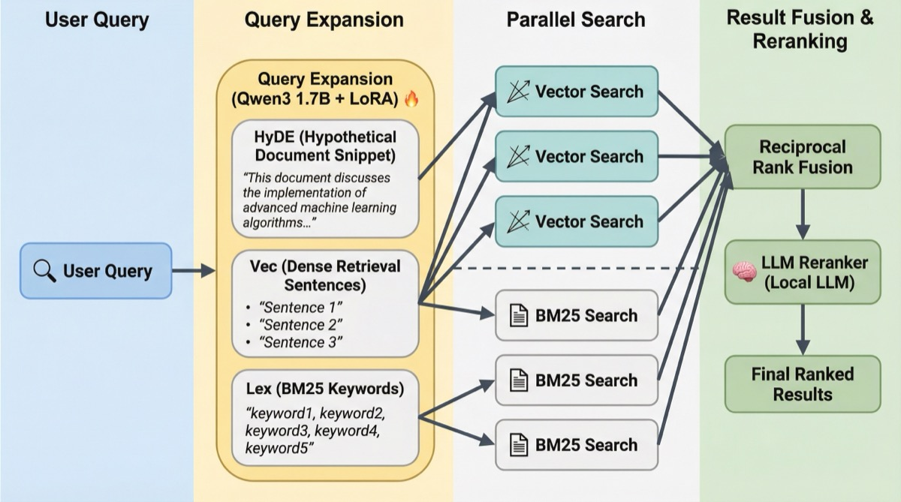

# FlowState-QMD

**The fastest, most trustworthy memory layer for coding agents.**

FlowState-QMD turns local markdown knowledge into shared project memory for Codex-, Claude-, Cursor-, and MCP-style agents. It combines a durable markdown memory store with a FlowState anticipatory cache so agents can pull relevant context before they fall into a reactive search loop.

[](https://opensource.org/licenses/MIT)
[](https://github.com/tobi/qmd)
[](#)



## Why This Wins

- **Anticipatory memory, not just stored memory.** FlowState prefetches context into `~/.cache/qmd/intuition.json` so agents can start from the right documents instead of deciding to search after the fact.
- **Built for coding agents.** It works best on docs, ADRs, RFCs, notes, runbooks, changelogs, migration logs, and benchmark writeups.
- **Local-first and inspectable.** Everything runs on your machine with SQLite, `sqlite-vec`, and local GGUF models via `node-llama-cpp`.
- **MCP-native.** The default experience is a clean MCP server plus a packaged agent skill.
- **Trust over magic.** Results keep file paths, doc IDs, snippets, and explain traces so the agent can show its work.

## Memory Model

- **Durable knowledge**: indexed markdown files in named collections
- **Working memory**: the FlowState anticipatory cache at `~/.cache/qmd/intuition.json`
- **Context overlays**: human-authored collection/path summaries added with `qmd context add`

## 90-Second Quickstart

```bash
git clone https://github.com/amanning3390/flowstate-qmd.git
cd flowstate-qmd
bun install

# Verify the host, recommend a profile, and emit wrapper configs
qmd init --target all

# Inspect readiness any time
qmd doctor

# Index your repo memory
qmd collection add ./docs --name docs
qmd collection add ./notes --name notes
qmd embed

# Start the coding-agent memory server
qmd mcp
```

If you want FlowState anticipatory memory too:

```bash
# Watch the current agent session log and keep the anticipatory cache warm
qmd flow ~/.codex/sessions/current.log --lite

# Compatibility alias also supported:
qmd flow start --watch ~/.codex/sessions/current.log --lite
```

## Demo Path

The best live demo for judges or teammates:

1. Index a repo's `docs/`, `notes/`, `CHANGELOG.md`, and ADRs.
2. Start `qmd flow` on an active coding-agent session log.
3. Ask a question like:
   - "Why did we roll back the auth migration?"
   - "What changed after the database incident?"
   - "What did we decide about the API contract in the ADR?"
4. Have the agent call `fetch_anticipatory_context` before a regular search.
5. Show that the returned memories already include the ADR, changelog, or meeting note the agent needed.

See [docs/DEMO.md](docs/DEMO.md) for an exact script.

## What Makes FlowState Different

Traditional RAG for agents looks like this:

```text
user asks → agent decides to search → tool call → wait → result processing → answer
```

FlowState-QMD changes the loop:

```text
user asks → anticipatory context already exists → agent answers or deepens with query/get
```

That difference matters most in coding workflows where the missing context is often already in:

- design docs
- changelogs
- migration notes
- incident writeups
- RFCs / ADRs
- benchmark reports

## Core Workflow

### 1. Index project memory

```bash
qmd collection add . --name repo-memory --mask '**/*.md'

# Compatibility alias
qmd index . --name repo-memory --mask '**/*.md'
```

### 2. Add context overlays

```bash
qmd context add qmd://repo-memory/docs "Project documentation and architecture notes"
qmd context add qmd://repo-memory/adr "Architecture decision records and tradeoff history"
qmd context add / "Answer as a coding agent using the repo's documented decisions"
```

### 3. Generate embeddings

```bash
qmd embed
```

### 4. Query project memory

```bash
# Auto-expand + rerank
qmd query "why was the rollout reverted"

# Structured search for better control
qmd query $'lex: "auth rollback" migration\nvec: why did we revert the auth migration?'

# Inspect why memories were chosen
qmd query --json --explain "performance regression in auth service"
```

### 5. Fetch exact evidence

```bash
qmd get "#abc123"
qmd multi-get "docs/**/*.md,CHANGELOG.md"
```

### 6. Run as MCP memory for agents

```bash
qmd mcp
```

The flagship tool order for coding agents is:

1. `fetch_anticipatory_context`
2. `query`
3. `get` / `multi_get`
4. `status`

## MCP Setup

### Claude Code / Codex-style local agents

```json
{
  "mcpServers": {
    "qmd": { "command": "qmd", "args": ["mcp"] }
  }
}
```

### One-command wrapper bootstrap

```bash
qmd init --target hermes
qmd init --target gemini,kiro,vscode
qmd doctor --json
```

`qmd init` now:

- profiles the host and recommends `standard` or `lite`
- writes a bootstrap report to `~/.cache/qmd/bootstrap-report.json`
- emits or installs config for Hermes, Claude Code, Codex, Gemini CLI, Kiro, VS Code, OpenClaw, and pi
- keeps the canonical `qmd` MCP namespace and tool order across every client

### Wrapper targets

- `hermes`: installs `~/.hermes/config.yaml`
- `claude-code`: installs `~/.claude.json`
- `codex`: installs `~/.codex/config.toml`
- `gemini`: installs `~/.gemini/settings.json`
- `kiro`: installs `.kiro/settings/mcp.json`
- `vscode`: installs `.vscode/mcp.json`
- `openclaw`, `pi`: emits ready-to-apply artifacts under `~/.cache/qmd/targets/`

### Install the packaged skill

```bash
qmd skill install --global --yes
```

The packaged skill is optimized for coding-agent memory and teaches the agent to:

- use `fetch_anticipatory_context` first
- use `query` for deeper retrieval
- use `get` / `multi_get` for exact evidence

## Anticipatory Memory Tool

`fetch_anticipatory_context` prefers the FlowState cache and falls back to a live project-memory query when needed.

Example payload:

```json
{
  "recent_conversation": "What changed in the auth rollback plan and why did we revert the migration?",
  "refresh": false,
  "lite_mode": false
}
```

Typical uses:

- current coding question with recent local context
- migration/debugging follow-up questions
- ADR/changelog lookups where the agent should feel preloaded

## CLI Highlights

```bash
qmd status
qmd collection list
qmd collection update-cmd docs 'git pull --rebase --ff-only'
qmd collection exclude archive
qmd ls repo-memory/docs
qmd cleanup
```

## Hardware Profiles

### Standard

- Qwen3 embedding + reranker models
- best quality
- recommended for Apple Silicon with 16GB+ RAM or comparable Linux hardware

### Lite

- lower-memory FlowState mode
- best for laptops or demo setups where you want the anticipatory cache running safely

Use:

```bash
qmd flow ~/.codex/sessions/current.log --lite
```

## Known Limits

- The best results come from markdown knowledge, not arbitrary binary project assets.
- Anticipatory memory depends on having an active session log to watch.
- First model-backed search can be slower while local models warm up.
- `qmd collection add`, `qmd embed`, and `qmd update` are intentionally manual operations; they are not auto-run by this repo's agents.

## Development

Use Bun in this repo.

```bash
bun install
npx vitest run --reporter=verbose test/
bun test --preload ./src/test-preload.ts test/
```

Important commands:

```bash
bun src/cli/qmd.ts <command>
qmd skill show
qmd mcp --http --daemon
qmd mcp stop
```

## Architecture

- **Store**: SQLite + FTS5 + `sqlite-vec`
- **Retrieval**: BM25 + vector search + reciprocal rank fusion + reranking
- **FlowState**: event-driven watcher that keeps `intuition.json` fresh
- **Interfaces**: CLI, MCP server, SDK, packaged agent skill

## Submission Assets

- Demo script: [docs/DEMO.md](docs/DEMO.md)
- Submission writeup: [SUBMISSION.md](SUBMISSION.md)
- Promo/demo video assets: [assets/video](assets/video)

## Why Ask When Your Agent Can Already Know?

FlowState-QMD is not trying to be every kind of memory system. It is trying to be the best coding-agent memory layer: fast, local, inspectable, shared across agents, and strong enough to make project context feel native.
